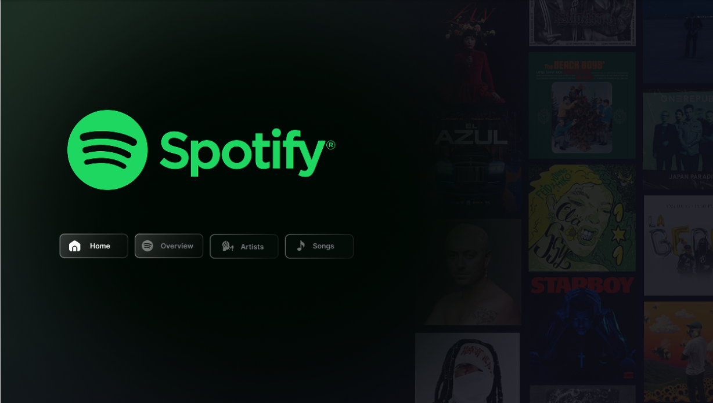
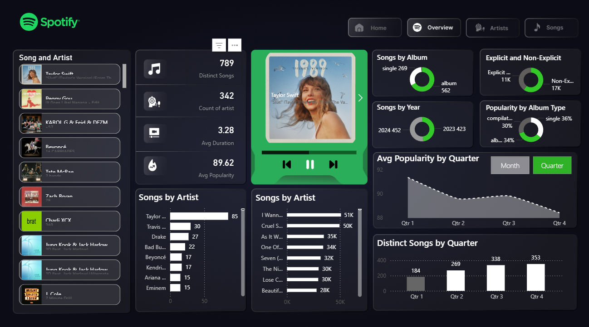
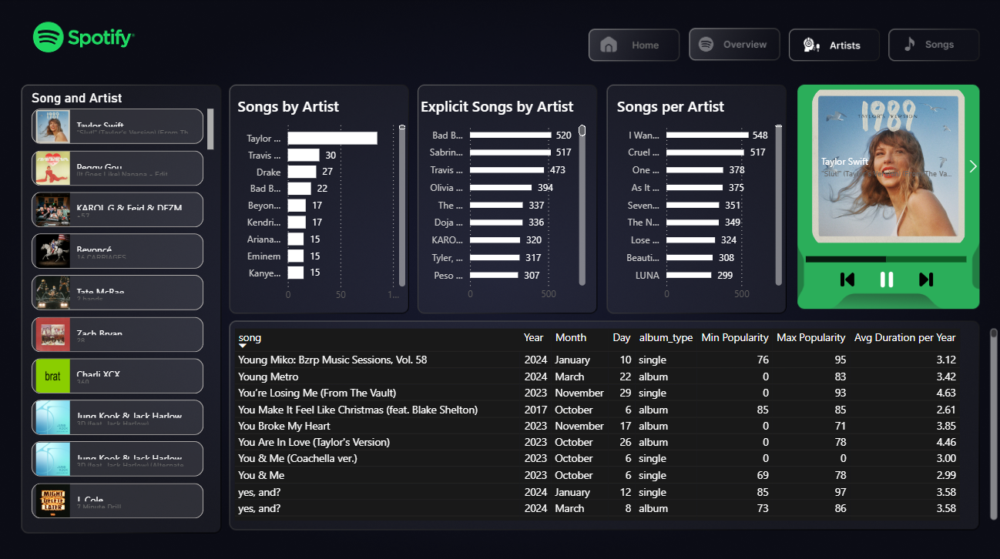
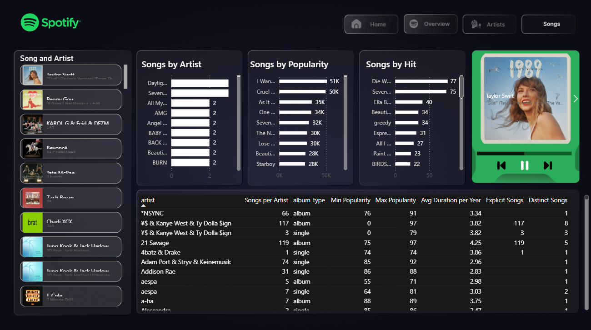

# 🎵 Spotify Music Analytics Dashboard

An interactive Power BI dashboard for analyzing music trends, artist performance, and song metrics using Spotify data. Gain insights into popularity patterns, release strategies, and content analysis across the music industry.

## 🎯 Purpose
This comprehensive dashboard provides music industry stakeholders with deep insights into streaming patterns, artist performance, and song characteristics. It enables data-driven decisions for A&R, marketing, and content strategy by visualizing key metrics from Spotify's music catalog.

## 🛠 Tech Stack
- **Data Visualization:** Microsoft Power BI
- **Data Processing:** Power Query
- **Data Analysis:** DAX (Data Analysis Expressions)
- **Data Source:** Spotify API / Spotify Dataset
- **Dashboard Features:** Multi-page Navigation, Interactive Filters, Advanced Visualizations

## 📊 Dashboard Overview

### 🏠 **Home/Index Page**
- Central navigation hub with four main sections:
  - Overview
  - Artists 
  - Songs
- Clean interface for seamless user experience

### 📈 **Overview Page** - Executive Summary
- **Top Artists Analysis:** Taylor Swift, Travis Scott, Drake leading with most songs
- **Album Type Distribution:** 562 albums vs 299 singles
- **Temporal Analysis:** 2024 (432 songs) vs 2023 (423 songs) comparison
- **Content Classification:** 11K Explicit vs 17K Non-Explicit songs
- **Quarterly Performance:** Popularity trends across business quarters
- **Release Strategy:** Album type impact on popularity metrics

### 🎤 **Artists Page** - Artist Performance Deep Dive
- **Artist Ranking:** Comprehensive leaderboard of top-performing artists
- **Song Volume Analysis:** Quantity of songs per artist
- **Explicit Content Tracking:** Monitoring of explicit songs by artist
- **Temporal Distribution:** Song releases across months and years
- **Popularity Metrics:** Min/Max popularity scores and duration analysis
- **Album Strategy:** Single vs album release patterns

### 🎵 **Songs Page** - Track-Level Analytics
- **Popularity Rankings:** "I Want...", "Cruel Summer", "As It Was" leading charts
- **Hit Song Analysis:** Identification of high-performing tracks
- **Artist Catalog Depth:** Number of songs per artist catalog
- **Detailed Metadata:** Album types, popularity ranges, duration trends
- **Content Classification:** Explicit content distribution
- **Release Year Analysis:** Temporal distribution of song releases

## 💡 Key Insights & Business Impact

### 🎶 **Artist & Repertoire Strategy**
- **Top Performers:** Taylor Swift dominates with extensive catalog and high popularity scores
- **Emerging Patterns:** Identify artists with growing influence and consistent performance
- **Catalog Depth Analysis:** Understand artist productivity and release frequency

### 📀 **Release Strategy Optimization**
- **Album vs Single Performance:** Singles show 36% popularity rate vs albums at 34%
- **Seasonal Timing:** Q1 shows highest distinct song releases (400+ tracks)
- **Content Planning:** Data-driven release scheduling based on historical performance

### 🎧 **Content & Audience Analysis**
- **Explicit Content:** Significant portion of catalog (11K songs) contains explicit content
- **Popularity Drivers:** Identify characteristics of high-performing songs
- **Duration Trends:** Average song duration analysis across different time periods

### 📊 **Business Intelligence Applications**
- **A&R Scouting:** Identify promising artists and trending musical styles
- **Marketing Allocation:** Target resources toward high-potential artists and songs
- **Content Strategy:** Optimize release schedules and album/single mix
- **Competitive Analysis:** Benchmark artist performance against industry standards

## 🚀 Getting Started

### Prerequisites
- Microsoft Power BI Desktop
- Basic understanding of music industry metrics
- Familiarity with streaming platform analytics

### Usage
1. Download the `.pbix` file from this repository
2. Open with Power BI Desktop
3. Navigate between Overview, Artists, and Songs pages using the index
4. Use interactive filters to explore specific artists, time periods, or song types
5. Hover over visualizations for detailed metrics and insights

## 📸 Dashboard Preview

### Index Page

### Overview Page  

### Artists Page

### Songs Page

---
